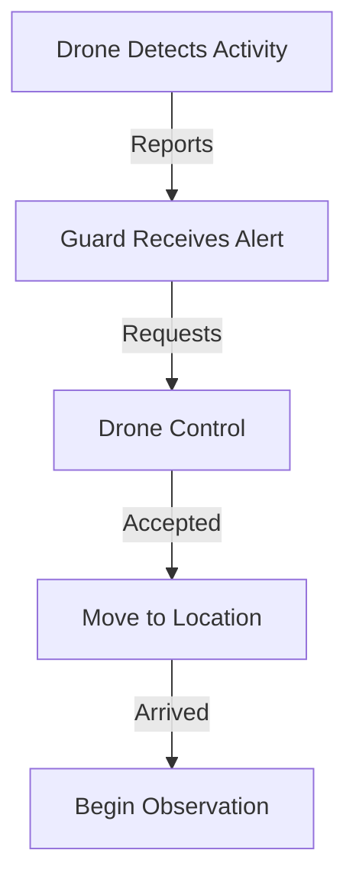
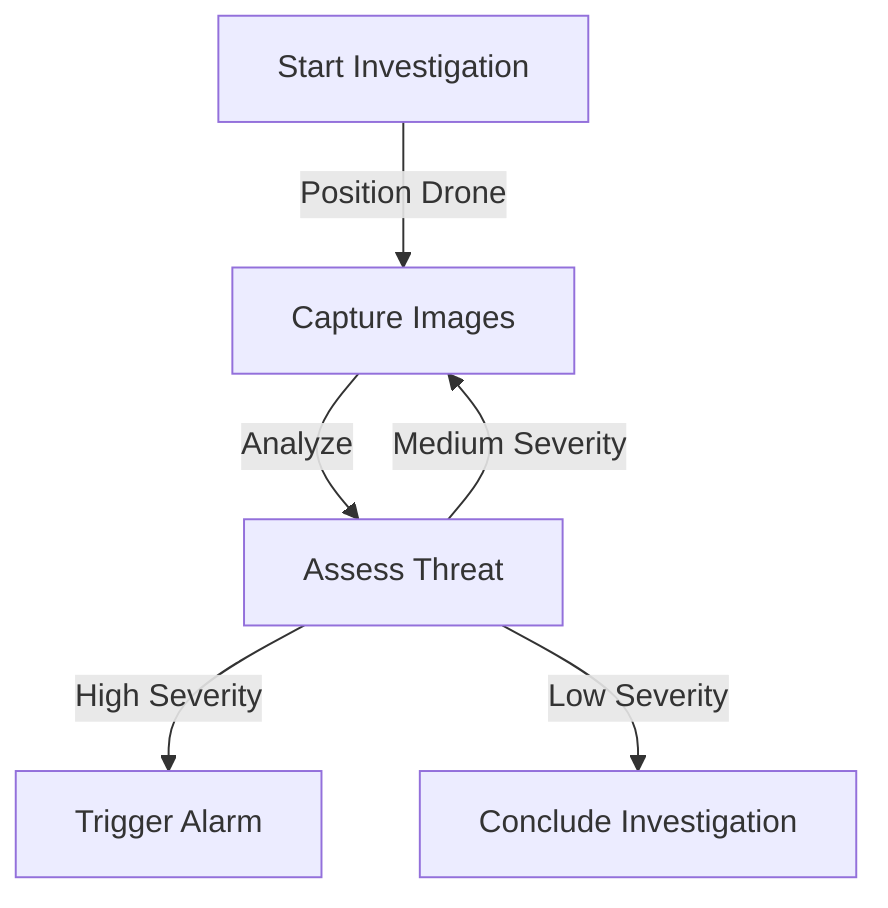

# GuardAgent Documentation

## Overview
The GuardAgent is a stationary agent responsible for investigating suspicious activities detected by drones in the surveillance system. It operates in a reactive manner, responding to alerts and managing drone control for detailed threat assessment.

## Core Components

### 1. Investigation Management
The GuardAgent uses a state machine to track and manage investigations:
- `MOVING_TO_LOCATION`: Initial state when drone is being positioned
- `OBSERVING`: Active investigation state with threat analysis
- `CONCLUDED`: Final state after threat assessment

### 2. Drone Control
- Single drone control policy
- Request/release mechanism
- Position-based movement commands
- Automatic timeout and release

### 3. Threat Analysis
- Vision-based threat assessment using GPT-4-Vision
- Severity scoring (0-1 scale)
- Automated response based on threat level
- Alarm system integration

## Operation Flow

### 1. Suspicious Activity Detection


### 2. Investigation Process


## Communication Protocol

### 1. Incoming Messages
- `SUSPICIOUS_ACTIVITY`: Initiates investigation
- `CONTROL_ACCEPTED`: Confirms drone control
- `DRONE_CAMERA_CAPTURE`: Image data for analysis

### 2. Outgoing Messages
- `CONTROL_REQUEST`: Request drone control
- `CONTROL_ENDED`: Release drone control

### 3. Unity Events
- `trigger_alarm`: Notify Unity client of confirmed threats
- `drone_camera_capture`: Process camera feeds

## State Management

### 1. Guard States
- Idle: No active investigation
- Investigating: Managing drone and analyzing threats
- Alarmed: High-severity threat confirmed

### 2. Investigation Tracking
```python
class Investigation:
    def __init__(self, camera_id: str, drone_position: Position):
        self.camera_id = camera_id
        self.initial_drone_position = drone_position
        self.state = InvestigationState.MOVING_TO_LOCATION
        self.severity_confirmed = False
        self.start_time = datetime.datetime.now()
```

## Key Methods

### 1. Core Agent Cycle
- `perceive()`: Process messages and events
- `plan()`: Monitor investigation timeouts
- `step()`: Execute Unity event processing

### 2. Investigation Control
- `start_investigation()`: Initialize new investigation
- `move_drone_to_camera()`: Position drone
- `analyze_threat()`: Process and score threats
- `conclude_investigation()`: Complete investigation

### 3. Drone Management
- `request_drone_control()`: Initiate control
- `release_drone_control()`: Return to autonomous mode

## Error Handling

### 1. Investigation Timeouts
- Maximum 5-minute observation period
- Automatic conclusion on timeout
- Logging of timeout events

### 2. Control Failures
- Message delivery confirmation
- Control state validation
- Graceful control release

## Best Practices

### 1. Investigation
- Quick response to suspicious activity
- Thorough threat analysis
- Clear severity thresholds
- Proper investigation conclusion

### 2. Drone Control
- Single drone per guard
- Minimal control duration
- Proper release protocol
- Position verification

### 3. Communication
- Clear message types
- Proper error handling
- Comprehensive logging
- Event-driven architecture

## Integration Points

### 1. DroneAgent Interface
- Control request/release protocol
- Position command format
- Camera feed processing

### 2. Unity Client
- Alarm triggering
- Camera feed processing
- Event synchronization

## Configuration

### 1. Threat Analysis
- Severity thresholds
- Investigation timeouts
- Vision API settings

### 2. Control Parameters
- Movement precision
- Timeout durations
- Message retry limits
